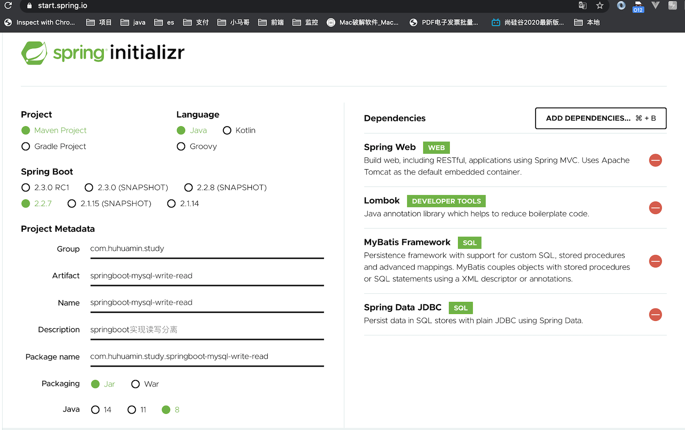

## 一、写在前面

### 	上一篇文章已经详细的讲解了mysql主从的搭建，如果您没有主从环境参考上篇文章 [docker-compose mysql5.7.30 主从](https://segmentfault.com/a/1190000022534413),准备好环境.

### 	Springboot 实现读写分离核心的类是AbstractRoutingDataSource，下面源码来自spring，版权属于spring所有.

```java
/*
 * Copyright 2002-2017 the original author or authors.
 *
 * Licensed under the Apache License, Version 2.0 (the "License");
 * you may not use this file except in compliance with the License.
 * You may obtain a copy of the License at
 *
 *      https://www.apache.org/licenses/LICENSE-2.0
 *
 * Unless required by applicable law or agreed to in writing, software
 * distributed under the License is distributed on an "AS IS" BASIS,
 * WITHOUT WARRANTIES OR CONDITIONS OF ANY KIND, either express or implied.
 * See the License for the specific language governing permissions and
 * limitations under the License.
 */

package org.springframework.jdbc.datasource.lookup;

import java.sql.Connection;
import java.sql.SQLException;
import java.util.HashMap;
import java.util.Map;

import javax.sql.DataSource;

import org.springframework.beans.factory.InitializingBean;
import org.springframework.jdbc.datasource.AbstractDataSource;
import org.springframework.lang.Nullable;
import org.springframework.util.Assert;

/**
 * Abstract {@link javax.sql.DataSource} implementation that routes {@link #getConnection()}
 * calls to one of various target DataSources based on a lookup key. The latter is usually
 * (but not necessarily) determined through some thread-bound transaction context.
 *
 * @author Juergen Hoeller
 * @since 2.0.1
 * @see #setTargetDataSources
 * @see #setDefaultTargetDataSource
 * @see #determineCurrentLookupKey()
 */
public abstract class AbstractRoutingDataSource extends AbstractDataSource implements InitializingBean {

	@Nullable
	private Map<Object, Object> targetDataSources;

	@Nullable
	private Object defaultTargetDataSource;

	private boolean lenientFallback = true;

	private DataSourceLookup dataSourceLookup = new JndiDataSourceLookup();

	@Nullable
	private Map<Object, DataSource> resolvedDataSources;

	@Nullable
	private DataSource resolvedDefaultDataSource;


	/**
	 * Specify the map of target DataSources, with the lookup key as key.
	 * The mapped value can either be a corresponding {@link javax.sql.DataSource}
	 * instance or a data source name String (to be resolved via a
	 * {@link #setDataSourceLookup DataSourceLookup}).
	 * <p>The key can be of arbitrary type; this class implements the
	 * generic lookup process only. The concrete key representation will
	 * be handled by {@link #resolveSpecifiedLookupKey(Object)} and
	 * {@link #determineCurrentLookupKey()}.
	 */
	public void setTargetDataSources(Map<Object, Object> targetDataSources) {
		this.targetDataSources = targetDataSources;
	}

	/**
	 * Specify the default target DataSource, if any.
	 * <p>The mapped value can either be a corresponding {@link javax.sql.DataSource}
	 * instance or a data source name String (to be resolved via a
	 * {@link #setDataSourceLookup DataSourceLookup}).
	 * <p>This DataSource will be used as target if none of the keyed
	 * {@link #setTargetDataSources targetDataSources} match the
	 * {@link #determineCurrentLookupKey()} current lookup key.
	 */
	public void setDefaultTargetDataSource(Object defaultTargetDataSource) {
		this.defaultTargetDataSource = defaultTargetDataSource;
	}

	/**
	 * Specify whether to apply a lenient fallback to the default DataSource
	 * if no specific DataSource could be found for the current lookup key.
	 * <p>Default is "true", accepting lookup keys without a corresponding entry
	 * in the target DataSource map - simply falling back to the default DataSource
	 * in that case.
	 * <p>Switch this flag to "false" if you would prefer the fallback to only apply
	 * if the lookup key was {@code null}. Lookup keys without a DataSource
	 * entry will then lead to an IllegalStateException.
	 * @see #setTargetDataSources
	 * @see #setDefaultTargetDataSource
	 * @see #determineCurrentLookupKey()
	 */
	public void setLenientFallback(boolean lenientFallback) {
		this.lenientFallback = lenientFallback;
	}

	/**
	 * Set the DataSourceLookup implementation to use for resolving data source
	 * name Strings in the {@link #setTargetDataSources targetDataSources} map.
	 * <p>Default is a {@link JndiDataSourceLookup}, allowing the JNDI names
	 * of application server DataSources to be specified directly.
	 */
	public void setDataSourceLookup(@Nullable DataSourceLookup dataSourceLookup) {
		this.dataSourceLookup = (dataSourceLookup != null ? dataSourceLookup : new JndiDataSourceLookup());
	}


	@Override
	public void afterPropertiesSet() {
		if (this.targetDataSources == null) {
			throw new IllegalArgumentException("Property 'targetDataSources' is required");
		}
		this.resolvedDataSources = new HashMap<>(this.targetDataSources.size());
		this.targetDataSources.forEach((key, value) -> {
			Object lookupKey = resolveSpecifiedLookupKey(key);
			DataSource dataSource = resolveSpecifiedDataSource(value);
			this.resolvedDataSources.put(lookupKey, dataSource);
		});
		if (this.defaultTargetDataSource != null) {
			this.resolvedDefaultDataSource = resolveSpecifiedDataSource(this.defaultTargetDataSource);
		}
	}

	/**
	 * Resolve the given lookup key object, as specified in the
	 * {@link #setTargetDataSources targetDataSources} map, into
	 * the actual lookup key to be used for matching with the
	 * {@link #determineCurrentLookupKey() current lookup key}.
	 * <p>The default implementation simply returns the given key as-is.
	 * @param lookupKey the lookup key object as specified by the user
	 * @return the lookup key as needed for matching
	 */
	protected Object resolveSpecifiedLookupKey(Object lookupKey) {
		return lookupKey;
	}

	/**
	 * Resolve the specified data source object into a DataSource instance.
	 * <p>The default implementation handles DataSource instances and data source
	 * names (to be resolved via a {@link #setDataSourceLookup DataSourceLookup}).
	 * @param dataSource the data source value object as specified in the
	 * {@link #setTargetDataSources targetDataSources} map
	 * @return the resolved DataSource (never {@code null})
	 * @throws IllegalArgumentException in case of an unsupported value type
	 */
	protected DataSource resolveSpecifiedDataSource(Object dataSource) throws IllegalArgumentException {
		if (dataSource instanceof DataSource) {
			return (DataSource) dataSource;
		}
		else if (dataSource instanceof String) {
			return this.dataSourceLookup.getDataSource((String) dataSource);
		}
		else {
			throw new IllegalArgumentException(
					"Illegal data source value - only [javax.sql.DataSource] and String supported: " + dataSource);
		}
	}


	@Override
	public Connection getConnection() throws SQLException {
		return determineTargetDataSource().getConnection();
	}

	@Override
	public Connection getConnection(String username, String password) throws SQLException {
		return determineTargetDataSource().getConnection(username, password);
	}

	@Override
	@SuppressWarnings("unchecked")
	public <T> T unwrap(Class<T> iface) throws SQLException {
		if (iface.isInstance(this)) {
			return (T) this;
		}
		return determineTargetDataSource().unwrap(iface);
	}

	@Override
	public boolean isWrapperFor(Class<?> iface) throws SQLException {
		return (iface.isInstance(this) || determineTargetDataSource().isWrapperFor(iface));
	}

	/**
	 * Retrieve the current target DataSource. Determines the
	 * {@link #determineCurrentLookupKey() current lookup key}, performs
	 * a lookup in the {@link #setTargetDataSources targetDataSources} map,
	 * falls back to the specified
	 * {@link #setDefaultTargetDataSource default target DataSource} if necessary.
	 * @see #determineCurrentLookupKey()
	 */
	protected DataSource determineTargetDataSource() {
		Assert.notNull(this.resolvedDataSources, "DataSource router not initialized");
		Object lookupKey = determineCurrentLookupKey();
		DataSource dataSource = this.resolvedDataSources.get(lookupKey);
		if (dataSource == null && (this.lenientFallback || lookupKey == null)) {
			dataSource = this.resolvedDefaultDataSource;
		}
		if (dataSource == null) {
			throw new IllegalStateException("Cannot determine target DataSource for lookup key [" + lookupKey + "]");
		}
		return dataSource;
	}

	/**
	 * Determine the current lookup key. This will typically be
	 * implemented to check a thread-bound transaction context.
	 * <p>Allows for arbitrary keys. The returned key needs
	 * to match the stored lookup key type, as resolved by the
	 * {@link #resolveSpecifiedLookupKey} method.
	 */
	@Nullable
	protected abstract Object determineCurrentLookupKey();

}

```

### 采坑指南
#### 1. exclude = {DataSourceAutoConfiguration.class} 需要排除自动装配数据源，否则会出现循环应用的bug The dependencies of some of the beans in the application context form a cycle:

#### 2. 需要扫你的Mybatis的Mapper包
#### 3. springboot 启动类需要如下注解

```java
@SpringBootApplication(exclude = {DataSourceAutoConfiguration.class})
@MapperScan("com.huhuamin.study.springbootmysqlwriteread.metadata")
```


## 二、springboot 读写分离实现

### 使用[start.spring.io](https://start.spring.io/) 脚手架快速创建框架	



### 使用IDEA CE[社区版](https://www.jetbrains.com/idea/download)  打开项目

### 我们使用[druid](https://github.com/alibaba/druid/tree/master/druid-spring-boot-starter)作为多数据源连接池，mysql作为数据库驱动,aop作为面向切面，由于start.spring.io 没有提供脚手架依赖，我们需要手动增加依赖
```xml
	<!--	增加druid springboot 	https://github.com/alibaba/druid/tree/master/druid-spring-boot-starter-->
		<dependency>
			<groupId>com.alibaba</groupId>
			<artifactId>druid-spring-boot-starter</artifactId>
			<version>1.1.17</version>
		</dependency>

        <dependency>
            <groupId>mysql</groupId>
            <artifactId>mysql-connector-java</artifactId>
        </dependency>    
		<!-- https://mvnrepository.com/artifact/org.springframework.boot/spring-boot-starter-aop -->
        <dependency>
            <groupId>org.springframework.boot</groupId>
            <artifactId>spring-boot-starter-aop</artifactId>
        </dependency>

```


### 参考[druid官方文档](https://github.com/alibaba/druid/tree/master/druid-spring-boot-starter) 增加多数据源,由于脚手架没有生成yml，在src/resouces下新建application.yml

```yml
spring:
  datasource:
    type: com.alibaba.druid.pool.DruidDataSource
    druid:
      hhm-master: # 主数据源
        driverClassName: com.mysql.cj.jdbc.Driver
        username: root   #账号
        password: 123456 #密码
        url: jdbc:mysql://127.0.0.1:3307/metadata?useUnicode=true&characterEncoding=UTF-8&autoReconnectForPools=true&zeroDateTimeBehavior=convertToNull&serverTimezone=GMT%2B8

      hhm-replic: # 从数据源
        driverClassName: com.mysql.cj.jdbc.Driver
        username: root #账号
        password: 123456 #密码
        url: jdbc:mysql://127.0.0.1:3308/metadata?useUnicode=true&characterEncoding=UTF-8&autoReconnectForPools=true&zeroDateTimeBehavior=convertToNull&serverTimezone=GMT%2B8


```

### 首先我们继承spring的 AbstractRoutingDataSource,实现我们自己的动态数据源切换，命名参考spring的默认实现Default开头，例如DefaultListableBeanFactory。我们这里用DefaultRoutingDataSource

```java
/**
 * @ClassName : DefaultRoutingDataSource  //类名
 * @Description : 动态数据源  //描述
 * @Author : 胡化敏（175759041@qq.com）
 * @Date: 2020年05月10日08:13  //时间
 */
public class DefaultRoutingDataSource extends AbstractRoutingDataSource {
    /**
     * 使用本地线程变了 ThreadLocal 通一个线程用 一个数据源
     */
    private static final ThreadLocal<String> contextHolder = new ThreadLocal<>();

    public DefaultRoutingDataSource(DataSource defaultTargetDataSource, Map<Object, Object> targetDataSources) {
        super.setDefaultTargetDataSource(defaultTargetDataSource);
        super.setTargetDataSources(targetDataSources);
        super.afterPropertiesSet();
    }

    @Override
    protected Object determineCurrentLookupKey() {
        return getDataSource();
    }

    public static void setDataSource(String dataSource) {
        contextHolder.set(dataSource);
    }

    public static String getDataSource() {
        return contextHolder.get();
    }

    public static void clearDataSource() {
        contextHolder.remove();
    }
}
```


### 动态数据源配置类，定义数据源bean（hhm-master，hhm-replic）和路由bean（dataSource）

```java
/**
 * @ClassName : DynamicDruidConfiguration  //类名
 * @Description : Druid 动态数据源配置  //描述
 * @Author : 胡化敏（175759041@qq.com）
 * @Date: 2020年05月10日08:19  //时间
 */
@Configuration
public class DynamicDruidConfiguration {
    public static final String DEFAULT_MASTER = "hhm-master";
    public static final String DEFAULT_REPLIC = "hhm-replic";

    @Bean
    @ConfigurationProperties("spring.datasource.druid." + DEFAULT_MASTER)
    public DataSource hhmMasterDataSource() {
        return DruidDataSourceBuilder.create().build();
    }

    @Bean
    @ConfigurationProperties("spring.datasource.druid." + DEFAULT_REPLIC)
    public DataSource hhmReplicDataSource() {
        return DruidDataSourceBuilder.create().build();
    }

    @Bean
    @Primary
    public DefaultRoutingDataSource dataSource(DataSource hhmMasterDataSource, DataSource hhmReplicDataSource) {
        Map<Object, Object> targetDataSources = new HashMap<>();
        targetDataSources.put(DEFAULT_MASTER, hhmMasterDataSource);
        targetDataSources.put(DEFAULT_REPLIC, hhmReplicDataSource);
        /**
         * 这里第一个参数是默认的数据源，由于我们系统metadata，是元数据模块，一般是读多写少，所以这里 默认使用从库读
         */
        return new DefaultRoutingDataSource(hhmReplicDataSource, targetDataSources);
    }
}
```


### 创建自定义一个注解，用于拦截切换数据源

```java
/**
 * @ClassName : 动态数据源注解  //类名
 * @Description : 动态数据源注解  //描述
 * @Author : 胡化敏（175759041@qq.com）
 * @Date: 2020年05月10日08:35  //时间
 */
@Target({ElementType.METHOD})
@Retention(RetentionPolicy.RUNTIME)
@Documented
@Indexed
public @interface DynamicDataSources {
    String value() default "";
}
```

### 使用aop技术，拦截用户数据源切换的逻辑

```java
/**
 * @ClassName : DataSourceAspect  //类名
 * @Description : 动态切换数据源 拦截器 //描述
 * @Author : 胡化敏（175759041@qq.com）
 * @Date: 2020年05月10日08:36 //时间
 * @see DynamicDruidConfiguration
 */
@Component
@Aspect
public class DataSourceAspect {

    @Around("@annotation(com.huhuamin.study.springbootmysqlwriteread.annotation.DynamicDataSources)")
    public Object around(ProceedingJoinPoint point) throws Throwable {
        MethodSignature signature = (MethodSignature) point.getSignature();
        Method method = signature.getMethod();
        DynamicDataSources dataSource = method.getAnnotation(DynamicDataSources.class);

        if (null != dataSource) {
            //预定大于配置，
            // 当在方法上使用 @DynamicDataSources 如果 update,save 使用主库，
            // 由于我们系统有删除标识，没有删除功能，如果你的系统里面有，可以修改这里的逻辑
            if (StringUtils.isEmpty(dataSource.value()) && (method.getName().contains("save") || method.getName().contains("update"))) {
                DefaultRoutingDataSource.setDataSource(DynamicDruidConfiguration.DEFAULT_MASTER);
            } else {
                DefaultRoutingDataSource.setDataSource(dataSource.value());
            }
        }
        /**
         *  如果没有注解{@link DynamicDruidConfiguration#dataSource} 配置了默认的数据源
         */

        try {
            return point.proceed();
        } finally {
            DefaultRoutingDataSource.clearDataSource();
        }
    }
}
```

### 我们拿省份数据来做测试,下面是sql

```sql
SET NAMES utf8mb4;
SET FOREIGN_KEY_CHECKS = 0;

DROP TABLE IF EXISTS `UFLY_METADATA_PROVINCE_BASE`;
CREATE TABLE `UFLY_METADATA_PROVINCE_BASE` (
  `u_id` char(32) NOT NULL COMMENT '主键',
  `u_parent_code` varchar(200) DEFAULT NULL COMMENT '上级编码',
  `u_code` varchar(200) DEFAULT NULL COMMENT '编码',
  `u_name` varchar(200) DEFAULT NULL COMMENT '名称',
  `u_initials` varchar(10) NOT NULL COMMENT '首字母',
  PRIMARY KEY (`u_id`)
) ENGINE=InnoDB DEFAULT CHARSET=utf8 ROW_FORMAT=DYNAMIC COMMENT='省表';

-- ----------------------------
-- Records of UFLY_METADATA_PROVINCE_BASE
-- ----------------------------
BEGIN;
INSERT INTO `UFLY_METADATA_PROVINCE_BASE` VALUES ('1', 'CN', '110', '北京市', 'B');
INSERT INTO `UFLY_METADATA_PROVINCE_BASE` VALUES ('10', 'CN', '320', '江苏省', 'J');
INSERT INTO `UFLY_METADATA_PROVINCE_BASE` VALUES ('11', 'CN', '330', '浙江省', 'Z');
INSERT INTO `UFLY_METADATA_PROVINCE_BASE` VALUES ('12', 'CN', '340', '安徽省', 'A');
INSERT INTO `UFLY_METADATA_PROVINCE_BASE` VALUES ('13', 'CN', '350', '福建省', 'F');
INSERT INTO `UFLY_METADATA_PROVINCE_BASE` VALUES ('14', 'CN', '360', '江西省', 'J');
INSERT INTO `UFLY_METADATA_PROVINCE_BASE` VALUES ('15', 'CN', '370', '山东省', 'S');
INSERT INTO `UFLY_METADATA_PROVINCE_BASE` VALUES ('16', 'CN', '410', '河南省', 'H');
INSERT INTO `UFLY_METADATA_PROVINCE_BASE` VALUES ('17', 'CN', '420', '湖北省', 'H');
INSERT INTO `UFLY_METADATA_PROVINCE_BASE` VALUES ('18', 'CN', '430', '湖南省', 'H');
INSERT INTO `UFLY_METADATA_PROVINCE_BASE` VALUES ('19', 'CN', '440', '广东省', 'G');
INSERT INTO `UFLY_METADATA_PROVINCE_BASE` VALUES ('2', 'CN', '120', '天津市', 'T');
INSERT INTO `UFLY_METADATA_PROVINCE_BASE` VALUES ('20', 'CN', '450', '广西壮族自治区', 'G');
INSERT INTO `UFLY_METADATA_PROVINCE_BASE` VALUES ('21', 'CN', '460', '海南省', 'H');
INSERT INTO `UFLY_METADATA_PROVINCE_BASE` VALUES ('22', 'CN', '500', '重庆市', 'C');
INSERT INTO `UFLY_METADATA_PROVINCE_BASE` VALUES ('23', 'CN', '510', '四川省', 'S');
INSERT INTO `UFLY_METADATA_PROVINCE_BASE` VALUES ('24', 'CN', '520', '贵州省', 'G');
INSERT INTO `UFLY_METADATA_PROVINCE_BASE` VALUES ('25', 'CN', '530', '云南省', 'Y');
INSERT INTO `UFLY_METADATA_PROVINCE_BASE` VALUES ('26', 'CN', '540', '西藏自治区', 'X');
INSERT INTO `UFLY_METADATA_PROVINCE_BASE` VALUES ('27', 'CN', '610', '陕西省', 'S');
INSERT INTO `UFLY_METADATA_PROVINCE_BASE` VALUES ('28', 'CN', '620', '甘肃省', 'G');
INSERT INTO `UFLY_METADATA_PROVINCE_BASE` VALUES ('29', 'CN', '630', '青海省', 'Q');
INSERT INTO `UFLY_METADATA_PROVINCE_BASE` VALUES ('3', 'CN', '130', '河北省', 'H');
INSERT INTO `UFLY_METADATA_PROVINCE_BASE` VALUES ('30', 'CN', '640', '宁夏回族自治区', 'N');
INSERT INTO `UFLY_METADATA_PROVINCE_BASE` VALUES ('31', 'CN', '650', '新疆维吾尔自治区', 'X');
INSERT INTO `UFLY_METADATA_PROVINCE_BASE` VALUES ('4', 'CN', '140', '山西省', 'S');
INSERT INTO `UFLY_METADATA_PROVINCE_BASE` VALUES ('5', 'CN', '150', '内蒙古自治区', 'N');
INSERT INTO `UFLY_METADATA_PROVINCE_BASE` VALUES ('6', 'CN', '210', '辽宁省', 'L');
INSERT INTO `UFLY_METADATA_PROVINCE_BASE` VALUES ('7', 'CN', '220', '吉林省', 'J');
INSERT INTO `UFLY_METADATA_PROVINCE_BASE` VALUES ('8', 'CN', '230', '黑龙江省', 'H');
INSERT INTO `UFLY_METADATA_PROVINCE_BASE` VALUES ('9', 'CN', '310', '上海市', 'S');
COMMIT;

SET FOREIGN_KEY_CHECKS = 1;

```


### 使用mybatis-gernerator 生成代码自行完成，我相信各个公司都有自己的mybatis代码生成器工具。本期提供UFLY_METADATA_PROVINCE_BASE生成java代码源码包含Action和Service，后期我会分享一个基础mybatis-generator扩展的可以生成Action，Service层的系列文章，欢迎大家关注公众号[胡化敏的技术分享]，获取最新文章

```java
.......
```


### 安装idea 插件  restfulToolkit,方便我们在idea直接调用http请求

### 如果没在更新上没有加注解,会出现--read-only option so it cannot execute this statement，走的是只读库


### 在更新或者修改或者删除操作上加上@DynamicDataSources或者强制指定@DynamicDataSources(value = DynamicDruidConfiguration.DEFAULT_MASTER)，正常写操作
### 如果再查询上@DynamicDataSources(value = DynamicDruidConfiguration.DEFAULT_MASTER)，那么读强制走主库去读


### 查看修改后的返回结果,从下面截图能看到 dataSource-1, dataSource-2是不同的数据源


```json
{
  "success": true,
  "code": 200,
  "data": {
    "total": 31,
    "list": [
      {
        "uId": "9",
        "uParentCode": "CN",
        "uCode": "310",
        "uName": "上海市ss",
        "uInitials": "S"
      }
      ....
    ],
    "pageNum": 1,
    "pageSize": 10,
    "size": 10,
    "startRow": 1,
    "endRow": 10,
    "pages": 4,
    "prePage": 0,
    "nextPage": 2,
    "isFirstPage": true,
    "isLastPage": false,
    "hasPreviousPage": false,
    "hasNextPage": true,
    "navigatePages": 8,
    "navigatepageNums": [
      1,
      2,
      3,
      4
    ],
    "navigateFirstPage": 1,
    "navigateLastPage": 4
  }
}
```


